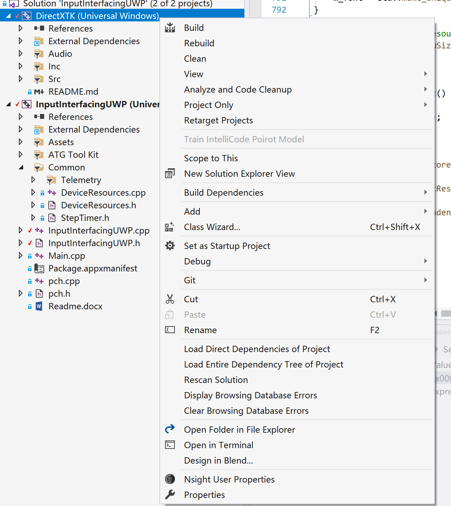
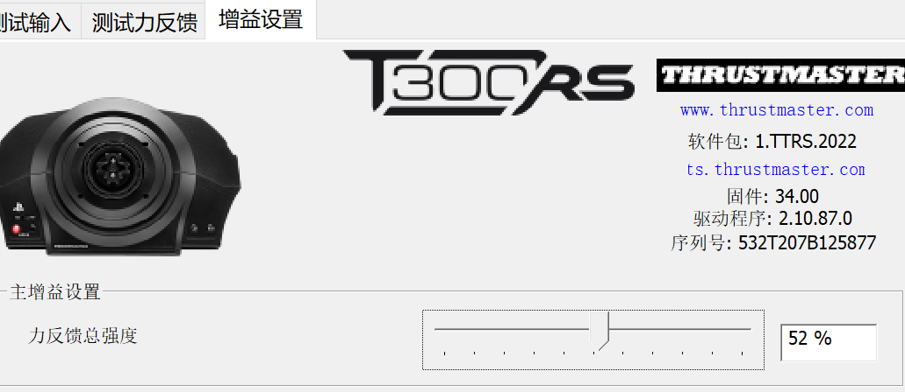
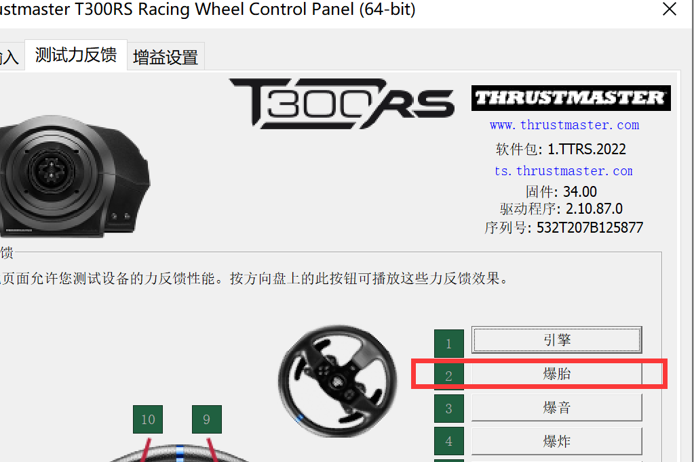
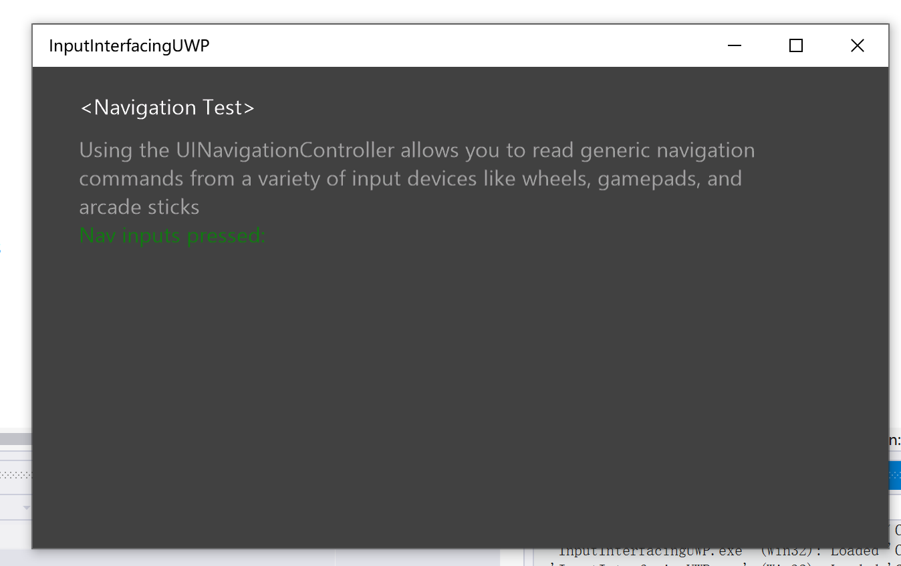
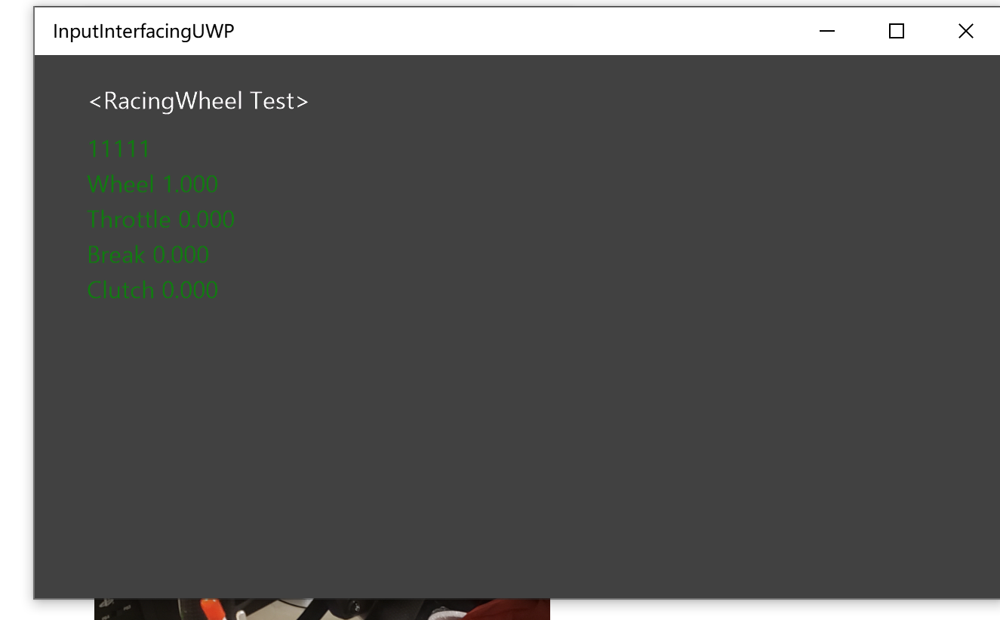

# InputInterfacingUWP

For more information see this [Word document](https://github.com/microsoft/Xbox-ATG-Samples/blob/main/UWPSamples/System/InputInterfacingUWP/Readme.docx).

## Privacy statement

For more information about Microsoft's privacy policies in general, see the [Microsoft Privacy Statement](https://privacy.microsoft.com/privacystatement/).

## Trademarks

This project may contain trademarks or logos for projects, products, or services. Authorized use of Microsoft trademarks or logos is subject to and must follow [Microsoft's Trademark & Brand Guidelines](https://www.microsoft.com/en-us/legal/intellectualproperty/trademarks/usage/general). Use of Microsoft trademarks or logos in modified versions of this project must not cause confusion or imply Microsoft sponsorship. Any use of third-party trademarks or logos are subject to those third-party's policies.

## Other Samples

For more ATG samples, see [Xbox-GDK-Samples](https://github.com/microsoft/Xbox-GDK-Samples/), [DirectML-Samples](https://github.com/microsoft/DirectML-Samples), [PlayFab-Samples](https://github.com/PlayFab/PlayFab-Samples), and [Xbox-LIVE-Samples](https://github.com/microsoft/xbox-live-samples).

# cat-auto-play-thrustmaster

## USE(使用方法)

1. vs打开项目 右键项目 properties调整编译sdk

   

2. - 

3. 运行项目
4. 在图马斯特控制台上将力反馈调低到50%以下

5.

点击一次爆胎测试

6.

在这个页面按下十字键左键

7. 此时页面是这样的
8. 

8.绑上玩具 大功告成!

